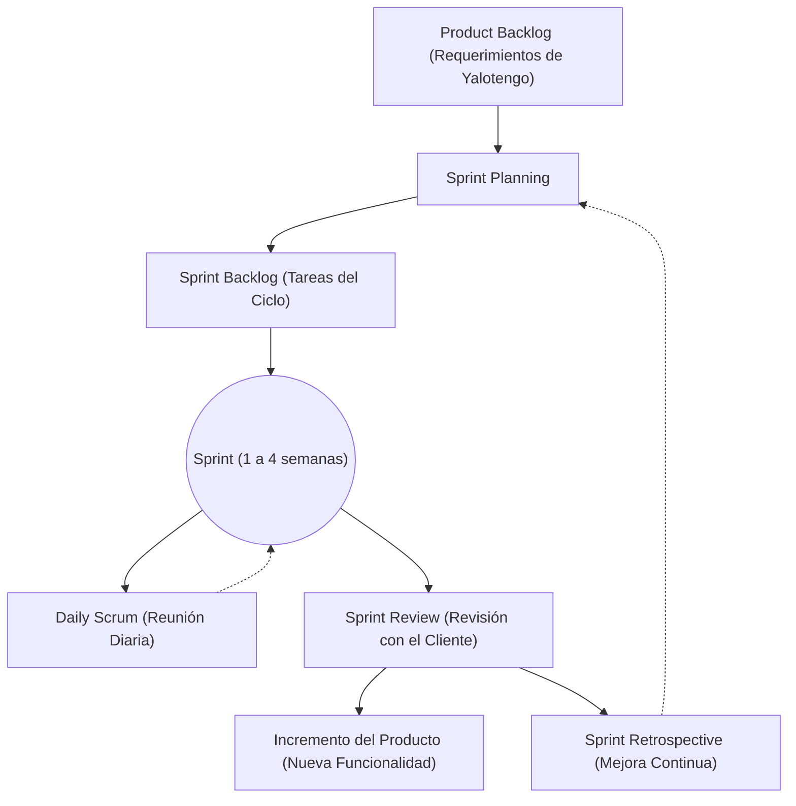

INFORME EJECUTIVO DE AVANCE DEL PROYECTO

YALOTENGO

Ecosistema Web de Comercialización Tecnológica

Integrantes:

Alvarado Silvano, Danilo

Rengifo Pinedo, Brittany Ariana

Mozombite Gastón, Fabrizio Gael

Rengifo Teagua, Axel Andre

Torres Flores, Julio Adrian

Reátegui Piña, Fressia Nicolle

Li, Xuan

Empresa: Invéntalo

Fecha: 15 de mayo de 2026

Metodología: Scrum (Desarrollo Ágil)

DATOS GENERALES

1. RESUMEN EJECUTIVO

El presente informe documenta el avance del proyecto "Yalotengo", una plataforma e-commerce de comercialización integral desarrollada para la iniciativa peruana "Invéntalo". El sistema tiene como objetivo centralizar y automatizar la venta de Modelos 3D digitalizados e impresos, cotizaciones personalizadas, libros digitales, inscripción a cursos técnicos, reserva de tickets para micromuseos y la gestión administrativa de activos para realidad aumentada.

El desarrollo se ejecuta bajo la metodología ágil Scrum, organizando el trabajo en sprints de duración definida. Hasta la fecha, el proyecto ha completado las fases de análisis de requerimientos y definición de la arquitectura del sistema, y se encuentra finalizando la etapa de Diseño de Interfaces Gráficas de Usuario, donde se han elaborado los prototipos y mockups de las pantallas principales de la plataforma.

2. METODOLOGÍA ÁGIL: SCRUM

2.1. ¿Por qué Scrum?

Se eligió Scrum por su capacidad de gestión iterativa e incremental, ideal para un proyecto con múltiples verticales de negocio. Este enfoque permite:

Entregas frecuentes de incrementos funcionales al final de cada sprint.

Adaptabilidad ante cambios de requerimientos durante el desarrollo.

Retroalimentación continua con los interesados de "Invéntalo".

**Diagrama de Flujo Scrum:**

2.2. Roles del Equipo Scrum

2.3. Personal Involucrado

3. PLANIFICACIÓN DE SPRINTS

3.1. Product Backlog

El Product Backlog contiene 36 Requisitos Funcionales organizados por módulo y prioridad. Los requisitos fueron levantados durante la fase de análisis y validados con el Product Owner.

3.2. Sprints Planificados

4. DISEÑO POR MÓDULO

A continuación se describe el diseño planificado de cada módulo del sistema, según los requisitos funcionales definidos en el Sprint 1.

4.1. Módulo de Autenticación y Perfil (RF-01 a RF-05)

Registro tradicional con validación de correo único.

Inicio de sesión con JWT, local y Google OAuth.

Edición de perfil con subida de avatar a MinIO.

Cambio de contraseña: el sistema verifica que la contraseña actual sea correcta antes de permitir el cambio, exige un mínimo de 8 caracteres para la nueva contraseña, y bloquea la opción para usuarios que se registraron vía Google OAuth.

4.2. Módulo de Modelos 3D (RF-06 a RF-14, RF-27, RF-28)

Catálogo público con filtros por categoría: Digitalizado e Impreso.

Carrito con prevención de duplicados para digitalizados.

Carrito con cantidad variable para modelos impresos.

Pasarela de pagos MercadoPago integrada.

Descarga segura de archivos en formato glb post-pago, solo para modelos digitalizados.

Seguimiento de entrega para modelos impresos: el administrador gestiona el estado del pedido a través de las fases ACCEPTED → IN_PROGRESS → DELIVERED, y el cliente puede consultar el estado desde su historial.

Módulo de cotizaciones personalizadas con hasta 5 imágenes referenciales.

Panel admin: CRUD completo de modelos con subida de archivos a MinIO.

4.3. Módulo de Libros (RF-15 a RF-17, RF-33)

Catálogo de libros con imagen de portada, autor y descripción.

Carrito con prevención de compra repetida. Si el libro ya fue comprado o ya está en el carrito, el sistema rechaza la operación para evitar cobros innecesarios.

Descarga automática de PDF tras confirmación de pago.

Panel admin: CRUD de libros con subida de imagen de portada y archivo PDF.

4.4. Módulo de Cursos (RF-18 a RF-20, RF-34)

Catálogo con cupos disponibles en tiempo real.

Control de cupos al momento del pago.

Inscripción automática post-pago.

Panel admin: CRUD de cursos con gestión de cupos.

4.5. Módulo de Reservas y Ticketing QR (RF-22 a RF-25, RF-35, RF-36)

Generación dinámica de slots por fecha y horario.

Reserva con selección de invitados de 1 a 10.

Pago con MercadoPago y generación de QR automático.

Expiración automática de reservas no pagadas a los 15 minutos.

Panel admin: Venta en taquilla en efectivo, Escáner QR y Gestión de reservas.

4.6. Módulo Unity AR — Gestión Backend (RF-29 a RF-32)

CRUD de especímenes con metadata taxonómica Darwin Core.

Subida de AssetBundles .unity3d, .glb y Targets a MinIO.

Soporte multilenguaje: ES, EN, PT, FR, IT, DE.

API pública `/public/targets` para consumo de la App Móvil AR.

Endpoint `/ar-login` para registro de usuarios desde la App.

Dashboard analítico AR con métricas de leads y modelos activos.

4.7. Carrito Unificado y Pasarela de Pagos (RF-21)

Carrito que acumula productos de todas las categorías: Modelos 3D, Libros y Cursos.

Pago consolidado en una sola transacción MercadoPago.

4.8. Dashboard Administrativo (RF-26)

Métricas en tiempo real: ingresos, modelos vendidos, libros, cursos inscritos, visitantes del día.

5. ETAPA ACTUAL: DISEÑO DE INTERFACES GRÁFICAS

5.1. Criterios de Diseño

El diseño de las interfaces se ha realizado siguiendo principios de UX/UI modernos, priorizando:

Estética: Paleta de colores con modo claro y acentos en verde esmeralda para transmitir innovación tecnológica.

Responsividad: Todas las interfaces son adaptativas a desktop, tablet y móvil.

Accesibilidad: Contraste adecuado, tipografía legible y navegación intuitiva.

Feedback visual: Animaciones de carga, toasts de confirmación, estados de botones activo/deshabilitado.

5.2. Principales Pantallas Diseñadas

5.2.1. Página de Autenticación.

Como usuario, necesito poder registrarme en la plataforma y acceder al sistema de forma segura. En esta pantalla, tengo la opción de crear una cuenta nueva o iniciar sesión ingresando mi correo electrónico y contraseña local. Alternativamente, si prefiero no recordar nuevas credenciales, puedo utilizar el botón de acceso rápido para registrarme o autenticarme de manera segura y en un solo paso mediante mi cuenta de Google.

5.2.2. Página de Inicio

Como usuario que ingresa por primera vez a Yalotengo, quiero ser recibido por una interfaz moderna e intuitiva que me invite a explorar. En esta pantalla principal, puedo visualizar un eslogan dinámico ("INVESTIGACIÓN. DESARROLLO. INNOVACIÓN.") acompañado de un diseño limpio que me permite identificar rápidamente la propuesta de valor. Desde aquí, utilizando la barra de navegación superior, puedo dirigirme de inmediato a los catálogos de Modelos 3D, Libros, Cursos o Reservas, o dirigirme directamente a mi carrito de compras mediante el botón principal.

5.2.3. Módulo de los Modelos 3D

- Cliente:

Como cliente interesado en visualización 3D, quiero explorar un catálogo específico de modelos digitales listos para descargar. En esta interfaz, navego a través de una cuadrícula de productos identificados con la etiqueta "GLB", donde puedo observar el nombre común, la taxonomía científica y el precio de cada modelo (por ejemplo, el "Ácaro de Cardo"). Desde aquí mismo, puedo tomar la decisión de añadir el archivo a mi carrito o comprarlo directamente sin tener que dar múltiples clics.

Como cliente que desea adquirir réplicas físicas de alta calidad, necesito un espacio diferenciado del catálogo digital. En esta vista, al seleccionar la pestaña de "Impresos", encuentro las figuras físicas disponibles para envío. Puedo evaluar el costo del "Impreso 3" y proceder a añadir la figura a mi carrito de compras o comprarlo directamente para que el equipo de Yalotengo gestione su producción y entrega a mi domicilio.

Como cliente con necesidades específicas, quiero encargar la creación de un diseño 3D que no se encuentra en el catálogo. Al presionar el botón "Cotización Personalizada", puedo redactar mis requerimientos detallados (indicando texturas, posturas y acabados deseados) y adjuntar fotografías reales de mi familia o mascotas como referencia. Además, esta misma pantalla me permite hacer seguimiento continuo al estado de mis solicitudes previas (si están pendientes o en revisión) y elegir si deseo que el equipo me contacte por WhatsApp o por correo electrónico.

- Administrador:

Como administrador del sistema, necesito mantener actualizado el catálogo de modelos 3D que ven los clientes. En este panel de gestión, tengo el control total para registrar nuevos modelos (tanto físicos como digitales), asignándoles un precio, nombre y descripción. También puedo utilizar herramientas de acción rápida para ocultar temporalmente, editar su información o eliminar registros de la base de datos de manera intuitiva.

Como administrador a cargo de la logística, quiero llevar un control riguroso de las ventas de modelos 3D físicos y digitales. En esta tabla de compras, puedo visualizar qué cliente (nombre y correo) realizó un pedido, qué modelo adquirió, el monto total pagado y la fecha exacta de la transacción. Mediante el botón de gestión, puedo actualizar en tiempo real el estado del envío para que pase de "Pagado" a "En curso" y finalmente a "Entregado", manteniendo un flujo ordenado.

Como administrador encargado de ventas personalizadas, necesito revisar detalladamente los encargos de los clientes. En esta vista de atención, puedo leer las especificaciones exactas solicitadas por el cliente, descargar de una sola vez (en un archivo ZIP) todas las fotos de referencia que adjuntó, y proceder a calcular el presupuesto. Esta interfaz me proporciona los datos de contacto del cliente (teléfono y correo) para poder responder y enviarle mi propuesta económica.

5.2.4. Módulo de Libros

- Cliente:

Como usuario en busca de material bibliográfico de la empresa privada Invéntalo, quiero poder adquirir libros digitales. En este catálogo, visualizo las portadas de los libros con un efecto de profundidad 3D, el nombre del autor y una breve reseña de la obra. Al elegir un libro de mi interés, como "El Infierno Amazónico", puedo comprarlo sabiendo que el sistema validará mi perfil para evitar que compre el mismo documento PDF dos veces por error.

- Administrador:

En el panel de control de libros, visualizo todo el inventario activo de literatura. Desde aquí puedo invocar un formulario para cargar el archivo PDF y la portada, ingresar el título, autor y precio, y controlar en cualquier momento qué libros están disponibles al público.

5.2.5. Módulo de Cursos

- Cliente:

Como persona interesada en la robótica y la impresión 3D, quiero informarme sobre los cursos disponibles e inscribirme rápidamente. En esta pantalla, analizo los banners promocionales de los cursos, reviso a quién están dirigidos (ej. "Robótica 12-15 años"), verifico la duración del curso en semanas y su precio final. Si estoy conforme, utilizo el botón directo para asegurar mi cupo añadiendo la inscripción a mi carrito.

- Administrador:

Como coordinador educativo, requiero gestionar la oferta de cursos y monitorear la ocupación de las aulas. En el panel de gestión académica, además de poder crear y editar la información de los cursos (fechas, temarios, precios), dispongo de un indicador vital que me muestra visualmente cuántos "Cupos" totales tiene la clase y cuántos han sido "Vendidos", permitiéndome tomar decisiones de marketing o cerrar inscripciones.

5.2.6. Pago para cualquier producto o servicio mediante MercadoPago

Como cliente que está finalizando su compra, exijo un proceso de pago seguro y flexible. En esta interfaz de checkout, encuentro un resumen del producto que estoy por adquirir y el total a pagar. Puedo optar por pagar mediante Tarjeta de Crédito/Débito llenando un formulario seguro integrado por MercadoPago (con validación de número de tarjeta, vencimiento, CVV y DNI) o seleccionar Yape, todo sin salir de la plataforma y garantizando la protección de mis datos.

5.2.7. Panel Administrativo — Gestión Micromuseo

Como administrador del Micromuseo Amazónico, necesito poblar la base de datos que consumirá la aplicación móvil de Realidad Aumentada. En este panel avanzado, registro detalladamente cada especie ingresando su taxonomía formal (Darwin Core), seleccionando la temática (insectos, microscópicos, personaje histórico, etc.) y configurando los idiomas disponibles. También cargo los marcadores de imagen objetivo y códigos QR que permitirán a la app de Unity poner los modelos 3D en la pantalla del usuario.

5.2.8. Módulo de Reservas

-Cliente:
Como visitante que planea asistir al micromuseo, quiero comprar mis entradas de forma anticipada. Utilizando esta interfaz de reservas, selecciono un día específico en un calendario interactivo y visualizo qué horarios (ej. 10:30 AM) tienen disponibilidad. Luego, ajusto el número de personas con los controles interactivos, lo cual calcula automáticamente el precio total (mostrando opciones referenciales si pago con tarjeta o Yape) para que proceda al pago y obtenga mis pases virtuales.

- Administrador:

Como personal de taquilla en el museo, necesito una herramienta rápida para atender a los visitantes sin reserva previa y validar accesos. En este panel dual, utilizo la sección de venta presencial para registrar cobros en efectivo seleccionando el horario actual y el número de personas. Simultáneamente, puedo cambiar al modo "Escáner QR" y utilizar la cámara web de la computadora para leer los boletos digitales en los celulares de los visitantes, permitiendo su ingreso al recinto.

5.2.9. Carrito de Compras

Como cliente que ha explorado toda la plataforma, quiero revisar mi pedido consolidado antes de pagar. En esta página, observo una lista clara de todos mis productos digitales e impresos. Puedo ajustar la cantidad de impresiones 3D que deseo o eliminar un curso si cambié de opinión, viendo cómo se actualiza el resumen del pedido en tiempo real. Finalmente, procedo a realizar el pago en la misma ventana usando el widget lateral cifrado de MercadoPago.

5.2.10. Historial de Compras

Como usuario frecuente, necesito un espacio centralizado para acceder a todo lo que he comprado. En la sección "Mis compras", mis adquisiciones están prolijamente categorizadas en pestañas. Desde aquí, puedo entrar a la pestaña de "Modelos 3D" o "Libros" y hacer clic en el botón de descarga para guardar los archivos GLB y PDF en mi dispositivo en cualquier momento.

5.2.11. Edición de Perfil

Como usuario registrado, requiero mantener mi información personal actualizada. En este formulario de perfil, puedo cambiar mi foto de avatar, actualizar mis nombres, apellidos y correo electrónico, y modificar mi contraseña local, asegurando que mis comunicaciones y recibos lleguen al lugar correcto.

5.2.12. Dashboard

Como dueño del proyecto "Yalotengo", necesito observar métricas clave para medir el éxito del negocio. Al ingresar al sistema, me dirijo al dashboard interactivo que recopila toda la data en un solo lugar: observo gráficas de ingresos mensuales, y tarjetas informativas que me indican el volumen de modelos vendidos, alumnos en los cursos e ingresos del micromuseo en tiempo real.

6. DISEÑO DE BASE DE DATOS (MODELO RELACIONAL)

El ecosistema Yalotengo maneja múltiples líneas de negocio, por lo que su base de datos relacional ha sido estructurada bajo un enfoque modular y escalable. A continuación, se presenta el esquema visual de la base de datos y la justificación técnica de su diseño:

6.1. Gestión Centralizada de Usuarios (`core_user`)
Toda la identidad del sistema converge en una única tabla de usuarios. Esto permite que un mismo individuo pueda ser cliente del e-commerce, administrador, o un usuario logueado desde la aplicación de Realidad Aumentada (`is_ar_user`). Además, cuenta con campos para soportar múltiples métodos de autenticación (contraseña encriptada y OAuth con `google_id`), manteniendo el control de acceso en un solo lugar.

6.2. Arquitectura de E-commerce Desacoplada
En lugar de tener una tabla gigante y genérica de "Productos" y "Ventas" llena de campos vacíos, el sistema separa las entidades según su naturaleza:
- Productos Independientes: Los modelos 3D (`mod_model3d`), los libros (`boo_book`), y los cursos (`cou_course`) tienen sus propias tablas. Un libro requiere "autor" y "pdf", mientras que un modelo 3D requiere "glb_filename". Separarlos evita redundancia de datos.
- Tablas de Transacción Específicas: Las compras también se aíslan (`mod_purchase`, `bpu_book_purchase`, `cpu_course_purchase`, `res_reservation`). Esto es vital porque una reserva requiere fecha y bloque de horario, mientras que la compra de un modelo impreso requiere estados de envío (`delivery_status`). Esta separación garantiza integridad referencial estricta.

6.3. Backend Especializado para Realidad Aumentada
El sistema aparta completamente la data científica de la data comercial. La tabla `mm_darwin_data` almacena las especies utilizando el estándar biológico internacional "Darwin Core" (reino, filo, clase, etc.) junto con los archivos AssetBundles para Unity. A su vez, `mm_darwin_translations` permite escalar el proyecto a múltiples idiomas (inglés, portugués, etc.) sin alterar la base de datos principal de la especie.

6.4. Tablas Auxiliares e Independientes
La solicitud de trabajos a medida (`cotizacion3d`) se mantiene separada de las compras directas, ya que representan un flujo de negociación (Pendiente, Cotizado, Rechazado) y no una transacción inmediata. Por último, las tablas de configuración (`sys_config`, `sys_languages`) dictan el comportamiento global de la plataforma sin afectar la lógica de negocio.

7. ARTEFACTOS SCRUM GENERADOS

7. TECNOLOGÍAS UTILIZADAS

8. CONCLUSIONES

1. El proyecto "Yalotengo" se encuentra avanzando conforme al cronograma establecido bajo la metodología Scrum.

2. Se han completado exitosamente los Sprints 1 y 2, cubriendo el análisis de requerimientos y la definición de la arquitectura del sistema.

3. El Sprint 3 se enfoca en el diseño de las interfaces gráficas de usuario mediante prototipos y mockups.

4. Las interfaces diseñadas cumplen con estándares modernos de UX/UI, priorizando la responsividad, la accesibilidad y la experiencia del usuario.

5. El desarrollo e implementación del código está planificado para el Sprint 4, una vez aprobados los diseños por el Product Owner.

9. PRÓXIMOS PASOS — SPRINT 4

9.1. Arquitectura y Configuración Inicial (Backend & Frontend)

Estructura Base: Configuración del servidor en Node.js/Express con gestión de variables de entorno, CORS y manejo de errores globales.

Base de Datos: Conexión a la base de datos MySQL usando Sequelize y configuración de migraciones/seeders iniciales.

Estado Frontend: Implementación de la gestión de estado global en React (Context API o Zustand) para el manejo de la sesión de usuario y el carrito de compras.

Cliente HTTP: Configuración de Axios con interceptores para inyección automática de tokens JWT en las cabeceras.

9.2. Desarrollo del Módulo de Autenticación y Usuarios

APIs de Acceso: Desarrollo de endpoints de registro, inicio de sesión (JWT) y cambio de contraseña seguro (bcrypt).

Autenticación Externa: Integración de Google OAuth 2.0 en el backend y frontend para inicio de sesión unificado ("Continuar con Google").

Gestión de Perfil: Creación del panel de usuario para edición de datos y subida de avatar a MinIO.

Seguridad: Implementación de roles (Usuario/Administrador) y protección de rutas en ambos entornos.

9.3. Desarrollo del Backend Core e Integración de Almacenamiento

Almacenamiento MinIO: Configuración del cliente MinIO y middlewares de Multer para la subida concurrente de archivos (.glb, .pdf) e imágenes.

Modelado de Datos: Definición de entidades relacionales para Productos (Modelos 3D, Libros, Cursos), Órdenes, Cotizaciones y Reservas.

APIs Administrativas: Desarrollo de controladores CRUD completos y paginados para cada entidad del sistema (Panel Admin).

9.4. Desarrollo de Interfaces de Catálogo y Cliente (Frontend)

Vistas de Catálogo: Construcción de grids responsivos y lógicas de filtrado por categoría (Digitalizados, Impresos, Libros).

Visor 3D: Integración del componente <model-viewer> para la previsualización interactiva de modelos digitales en el navegador.

Formularios Dinámicos: Desarrollo de la vista de cotizaciones personalizadas con capacidades de carga de múltiples imágenes adjuntas.

Lógica de Carrito: Programación del carrito unificado (agregar, quitar, sumar cantidades físicas y prevención estricta de duplicados digitales).

9.5. Integración de Pasarela de Pagos (MercadoPago)

Checkout: Creación de la preferencia de pago dinámica en el backend integrando el SDK oficial de MercadoPago.

Frontend Widget: Inserción y configuración del formulario seguro de pago dentro de la vista del carrito.

Webhooks: Implementación de endpoints seguros para recibir notificaciones asíncronas de pagos (IPN) y actualizar el estado de los pedidos automáticamente.

Entregables Post-Pago: Lógica para habilitar las URLs de descarga de archivos (GLB, PDF) y confirmar cupos de cursos únicamente tras el pago exitoso.

9.6. Módulo de Reservas y Gestión de Micromuseo (AR)

Lógica de Aforo: Algoritmos para generación dinámica de slots horarios disponibles por fecha, respetando la capacidad máxima del micromuseo.

Generación de Tickets: Integración de librería para la creación automática de códigos QR con la información de la reserva encriptada.

Escáner Web: Implementación del lector QR en el panel administrativo usando la cámara del dispositivo para control de acceso (Taquilla).

APIs para Unity: Configuración del CRUD del Micromuseo (metadata Darwin Core) y apertura de endpoints de sólo lectura para consumo de la App de Realidad Aumentada.

9.7. Calidad, Pruebas y Despliegue

Testing: Realización de pruebas End-to-End (E2E) simulando el flujo crítico de "Registro -> Compra -> Pago -> Descarga".

Dockerización: Construcción de los Dockerfiles para las aplicaciones y definición de la red interna en docker-compose.yml.

Infraestructura: Despliegue en el VPS de producción (Linux/Ubuntu), configuración de Nginx como Reverse Proxy, asignación de dominios y provisión de certificados SSL.

Elaborado por el Equipo de Desarrollo Yalotengo — Invéntalo, 2026.

